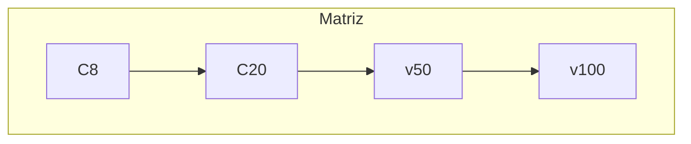
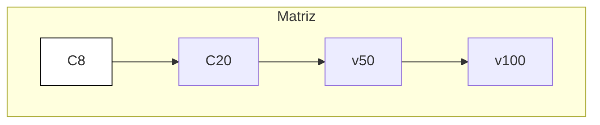
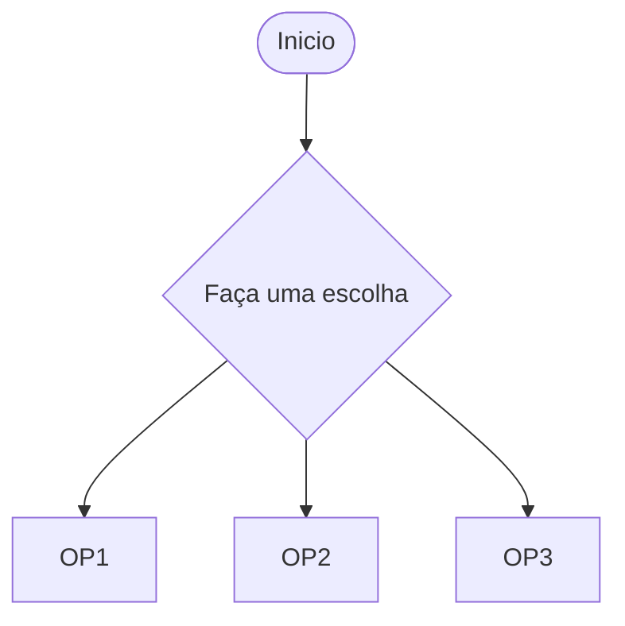
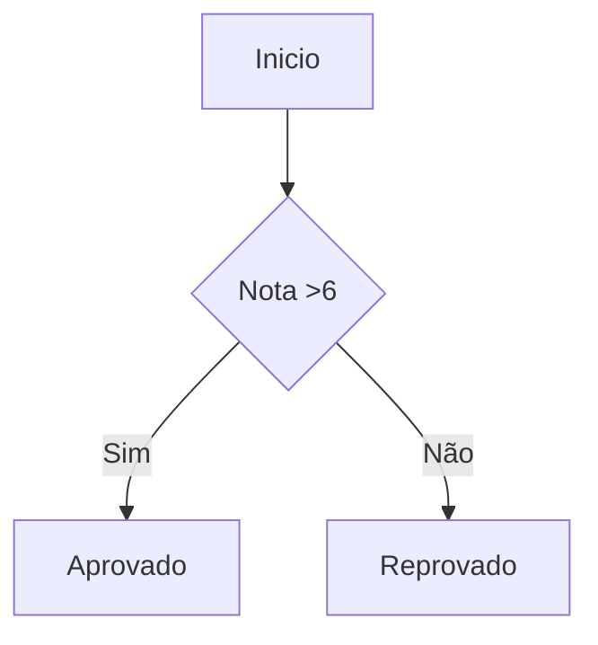
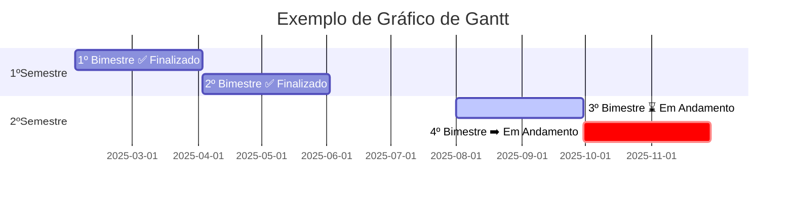

```mermaid
graph TD
    subgraph Matriz
A1["C8"]:::branco --> A2["C20"]:::AMARELO --> A3["v50"]:::laranja --> A4["v100"]:::vermelho

end
```

```mermaid
graph TD
    subgraph Matriz
A1["C8"]:::branco --> A2["C20"]:::AMARELO --> A3["v50"]:::laranja --> A4["v100"]:::vermelho

end
classDef branco fill:#fff, stroke:#000, stroke-width:1px;
```

```mermaid
flowchart TD
    A(["Inicio"])
    A --> B{"Faça uma escolha"}
    B --> C["OP1"]
    B --> D["OP2"]
    B --> E["OP3"]
 
```

```mermaid
graph TD;
    A[Inicio] --> B{Nota >6};
    B --> |Sim| C[Aprovado];
    B --> |Não| D[Reprovado];
```

```mermaid
gantt
  title Exemplo de Gráfico de Gantt
  dateFormat YYYY-MM-DD
  section 1ºSemestre
1º Bimestre ✅ Finalizado:a1, 2025-02-02, 60d
2º Bimestre ✅ Finalizado:a2, after a1, 60d
  section 2ºSemestre
3º Bimestre ⌛ Em Andamento:active, a3, 2025-08-01, 60d
4º Bimestre ➡️ Em Andamento:crit, a4, after a3, 60d
```
